该版本是 node.js 的 Version 13，通过 VS Code 一步一步调试，大致了解了 node 的启动流程，同时也对 C++ 的语法和使用有了一些了解

## 从入口开始

在 `node_main.cc` 文件中，这一行就是本次旅程的起点，`node::start` 启动并将 `argc` ( node 接收到的参数总数)和 `argv` (参数地址)传入。

<!-- more -->

### InitializeOncePerProcess

在 `node.cc`文件中，这行是开始初始化进程，从名字可以看出，这里保证只执行一次

`atexit` 函数，从命名可以知道这个是在程序即将结束时会被触发，`resetStdio` 函数用来对标准 I/O 资源的回收，包括文件描述符 `fd` 和 `tty` 相关的。

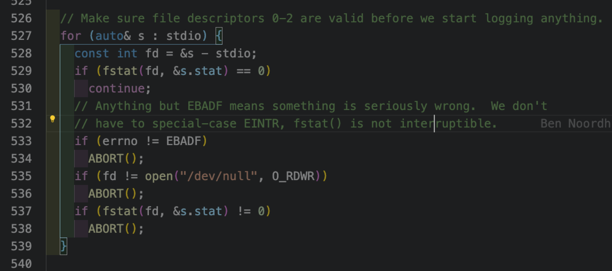

### PlatformInit

`PlatformInit` 函数，主要是对不同平台进行兼容并做一些平台相关的初始化工作，例如这里就是对文件描述符 `fd` 的初始化，确保进程中 `fd` **0(stdin)、1(stdout)、2(stderr)** 是正常的， `fstat` 会返回文件的相关信息，**535** 行的作用是保证 `fd` 为 **0 1 2** 的值都已经被占用，`fd` 分配从 **3** 开始，`fd` 表示的是进程能打开的文件数，系统默认是 **1024**

定义并初始化 `act` 变量，根据系统的 **signal** 值，对不同的 **signal** 注册触发函数

通过 `fcntl` 函数读取文件的文件描述符标记，`fcntl` 的文件状态标志总共有 **7** 个：**O_RDONLY , O_WRONLY , O_RDWR , O_APPEND , O_NONBLOCK , O_SYNC 和 O_ASYNC**

`RegisterSignalHandler` 注册系统信号的触发函数，上面的是进程结束时的信号，**SIGINT** 当我们敲 **c t r l + c** 时会发出，**SIGTERM** 该信号可以被阻塞，等待合适时机再进行退出处理，而 **SIGKILL** 信号则是不能被捕获的，一旦发出则程序一定会退出，例如 `kill -9` 命令就会发出该信号

`getrlimit` 是用来获取系统限定资源信息的函数， **RLIMIT_NOFILE** 的意思就是获取最大的文件描述符数，分为软限制和硬限制，软限制的值不能大于硬限制，这里利用二分搜索找出系统能设置的最大值

### uv_setup_args

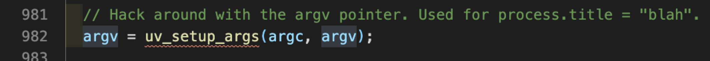

`uv_setup_args` 的作用是复制一份命令行的参数，用于赋值给 `process.title`

### InitializeNodeWithArgs

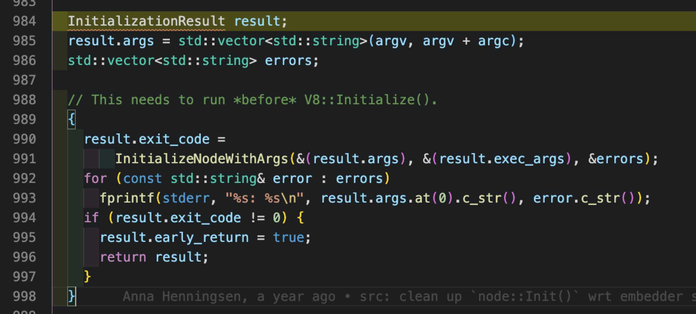

### RegisterBuiltinModules

**node_biding.cc**

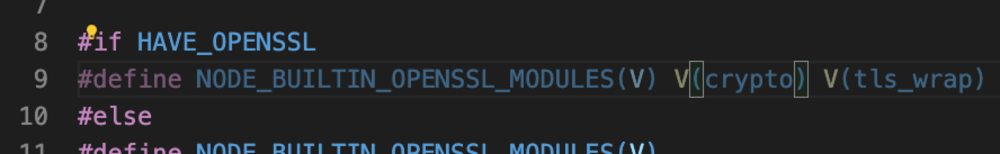

`RegisterBuiltinModules` 注册内置模块，使用了宏的写法，这些模块就是在 **no de_XX.cc** 中的模块，生成一个 **modlist_internal** 链表中借助 **nm_link** 指针指向下一个模块

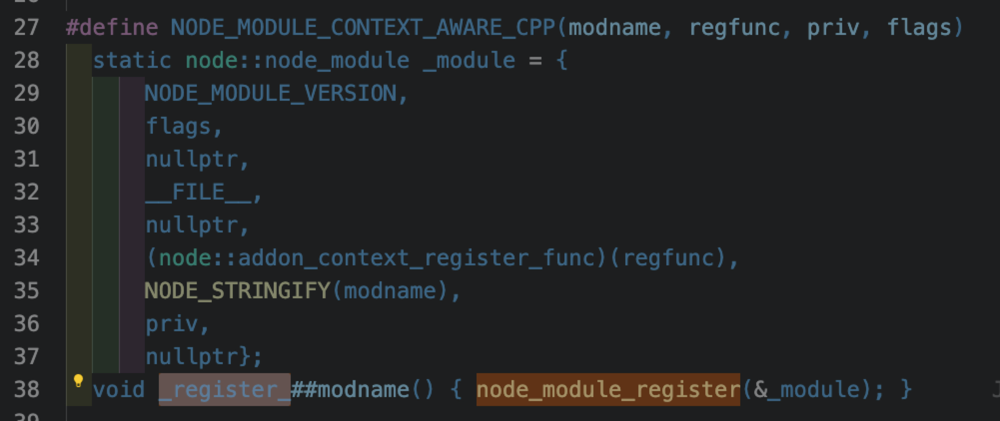

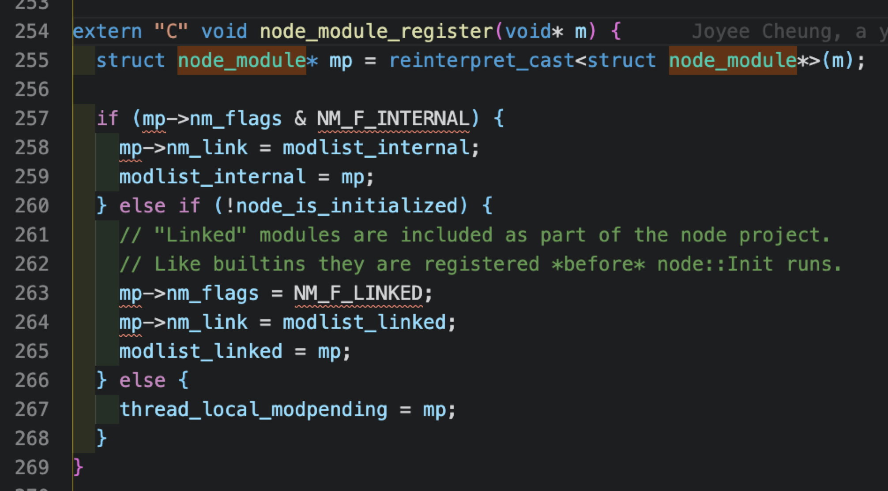

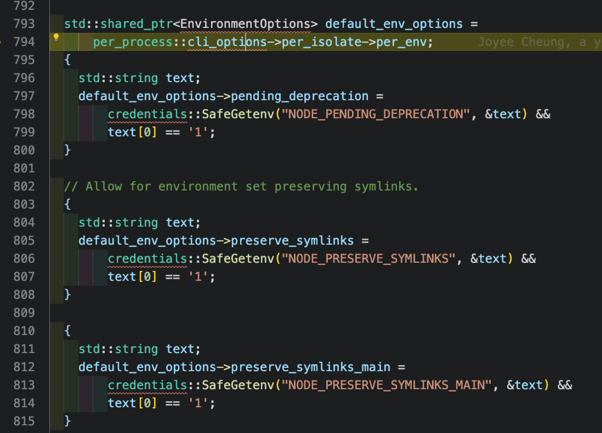

接下来是一些 Node 环境变量的配置

把命令行中的配置项，例如 **--** 或者 **-** 开头的从 **argv** 分离到 **exec_argv** 中

### InitializeCodeCache

**node_code_cache.cc**

这一步把提前编译好的 **lib** 下的 **js** 文件都存放在 **code_cache** 的 **map** 中，免去了读入文件的过程，加快启动速度

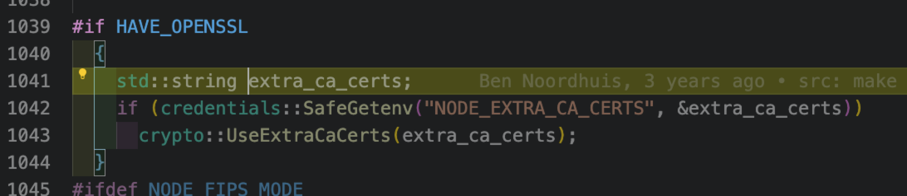

如果使用了 **openssl** 则使用 **ca** 证书，借助 **BIO** 进行读取

### per_process::v8_platform.Initialize

**node_v8_platform-inl.h**

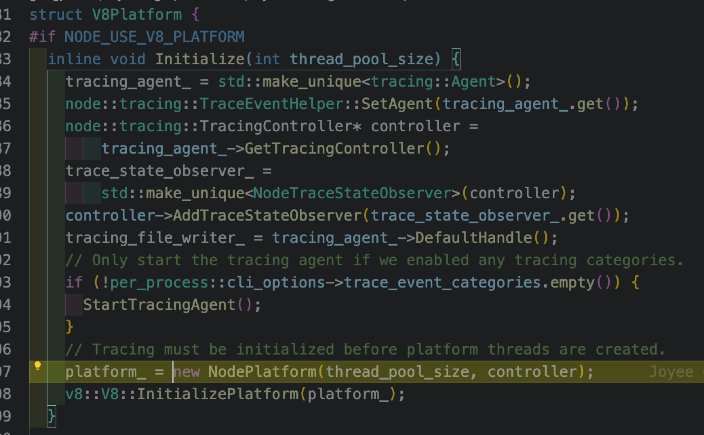

**node_platform.cc**

初始化 **V8** 平台相关的准备工作，包括添加运行状态追踪，生成 **node** 平台实例，配置多线程的线程池资源

### v8::V8::InitializePlatform

**api.cc**

**v8.cc**

初始化 **V8** 平台，包括调用栈追踪和调用栈等功能的初始化

**node** 的代码中很多 **v8::XX** 和 **v8::internal::XX** 的转换，等于是在中间加多了一层，对外暴露的 **API** 是 **v8::XX**，而 **v8::internal::XX** 则是内部实现，这样可以将代码分离，内部的变更都不会影响外部 **API**

### V8::Initialize

**node.cc**

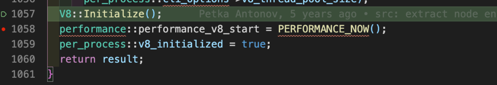

### v8::internal::V8::InitializeOncePerProcess

**v8.cc**

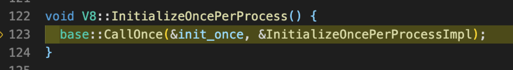

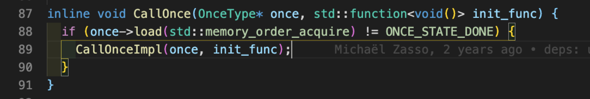

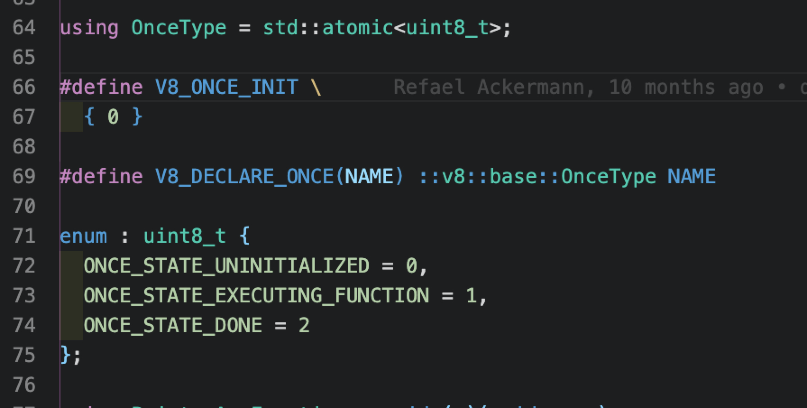

这里从命名就可以看出是只会执行一次的逻辑，类似的变量均被定义为 **OnceType** 类型，该类型的实质是 **C++** 中的 **std::atomic**，该类型是用来多线程中避免竞争的原子操作原语，而 **init_once** 则是 **OnceType** 类型

**load** 和 **store** 是读写值时使用的函数， **Memory Order** 意思是内存顺序，是 **CPU** 对指令执行优化引申的一个概念，多线程的同步机制一般有 **mutex** 和 **atomic**，前者性能消耗大于后者。

**once.cc**

此处的 **memory_order_acquire** 对应的是 **release-acquire** 机制，保证了线程读写对其他线程的可见性，这里我们可以看到 **callOnceImpl** 的实现，如果 **once** 的状态为**已完成**则直接返回，否则初始化一个 **expected** 变量赋值为**初始态**，**compare_exchange_strong** 的作用就是做一次 **CAS(compare and swap)** 如果变量的值符合预期，即 **初始态** ，那么就更新变量的状态为 **执行中** ，执行 **init_func** 结束后，将变量状态设置为 **结束态** ，如果 **CAS** 操作没有成功，且此时状态为 **执行中** ，就调用**sched_yield** 交出执行权，这里的机制类似 **JS** 的 **generator**

### V8::InitializeOncePerProcessImpl

**v8.cc**

这里主要是做了各种初始化操作，包括 **OS** ，**Isolate** 的线程标识 ，还注册了一系列 **v8** 扩展

至此 **node::Start** 中的 **InitializeOncePerProcess** 完成

### Node::Start

**node.cc**

初始化 **params** 用于 **Isolate** 的初始化，然后获取 **snapshot(快照)** ，这是 **Node** 引入的加快启动速度的优化，将 **Isolate** 和 **Context** 的部分初始值序列化后嵌入程序中，然后后续的初始化可以复用他们之前的 **snapshot**

### main_instance

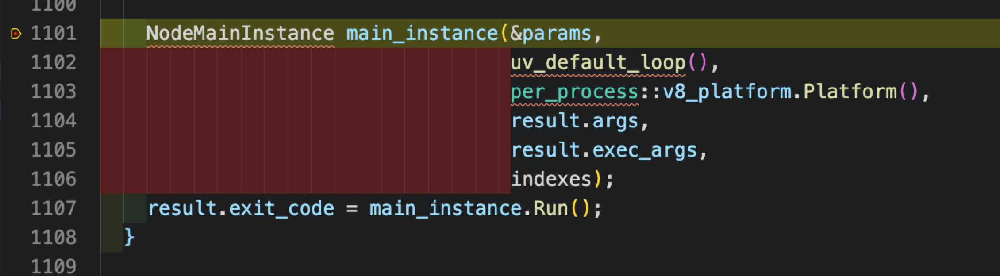

生成 **main_instance** 实例，将 **Isolate** 的 **params** ，**libuv** ，先前生成的 **v8_platform** ，命令行参数 **args** ，带 **--** 或 **-** 的参数 **exec_args** 传入

**node_main_instance.cc**

**isolate.cc**

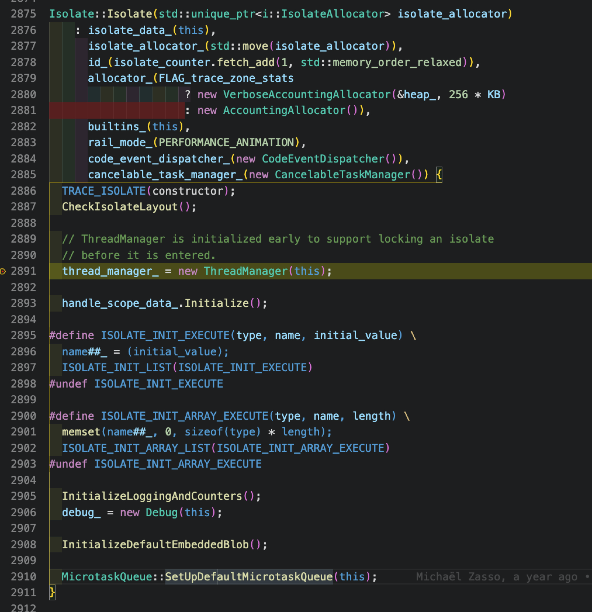

第 **71** 行 为 **Isolate** 初始化做前期工作，在第 **2819** 行初始化 **Isolate** 实例，**isolate*data*** 保存了 **Isolate** 数据，**isolate*allocator*** 保存了 **Isolate** 的内存地址，接着初始化了线程管理器 **ThreadManager** ，最后初始化了微任务队列 **MicrotaskQueue** 这是一个双向循环链表

第 **75** 行在 **platform** 中注册 **Isolate** ，将该 **Isolate** 和 **eventloop** 的信息记录在 **map** 中，便于多 **Isolate** 条件下的查找

第 **76** 行根据 **params** 的值设置 **node** 的 **heap** 堆内存资源额度，包括新生代，老生代，**semispace**

第 **77** 行真正初始化 **Isolate**，根据 **params** 为 **Isolate** 赋值

**api.cc**

这里设置了堆栈的资源额度限制真正开始生效，第 **8224** 行从 **snapshot** 中获取部分数据赋值给 **Isolate**

**isolate_scope** 负责记录 **isolate** 被线程访问的情况，通过 **EntryStackItem** 记录

至此，**Isolate** 的初始化正式完成

保存一份 **IsolateData** 在 **NodeMainInstance**

### NodeMainInstance::Run

启动的前期工作准备就绪，这时候开始运行 **main_instance**

**HandleSope** 经常能在代码中看到，这等于是开拓了一片作用域，在这之后的**Local** 变量都会被纳入 **V8** 的内存管理，在代码运行结束后资源能够被 **GC** 回收，这是一个简化的操作，实现原理是通过生成实例时调用 **enter** 方法，然后再运行结束时 C++会自动调用**析构函数**，这时候调用 **exit** 方法，起到了自动管理的作用

### NodeMainInstance::CreateMainEnvironment

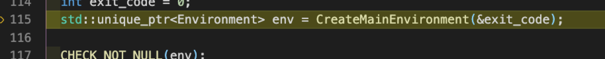

这里根据 **snapshot** 初始化 **context** ，下面的 **context_scope** 作用同上，其中的**context** 会被注入到 **JS** 中作为全局的 **global** 对象

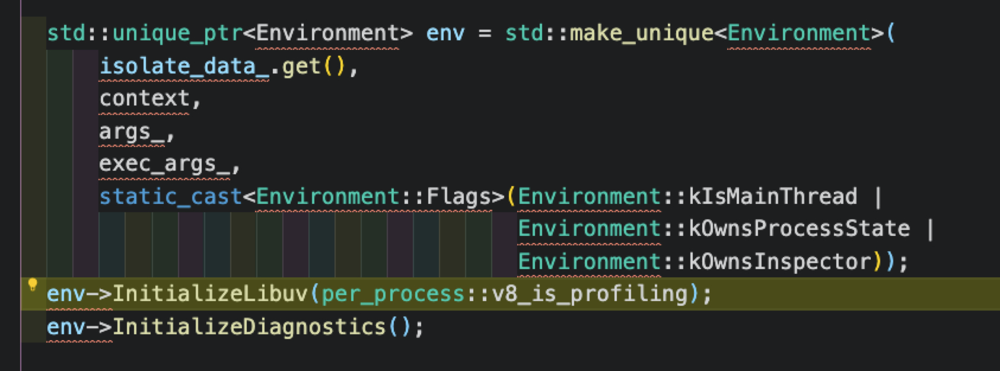

生成指向 **Environment** 的指针，这个时候会实例化 **Environment**，然后生成 **node** 中的 **process** 和 **primordials** 对象，准备注入到 **Js** 中

接下来开始初始化 **libuv** 和 诊断相关的逻辑

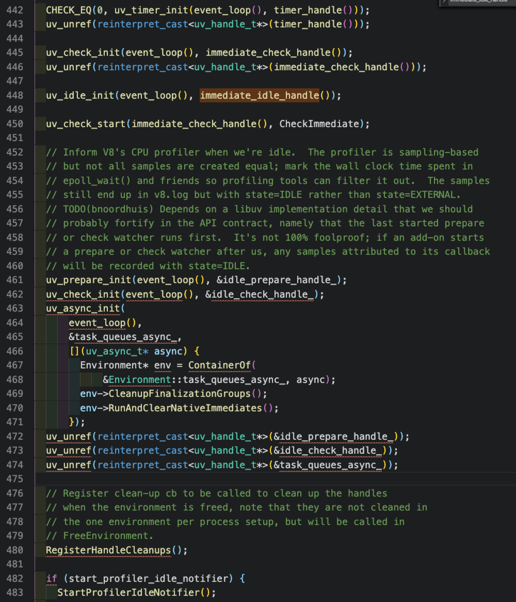

注册不同阶段的 **handle**

### Environment::RunBootstrapping

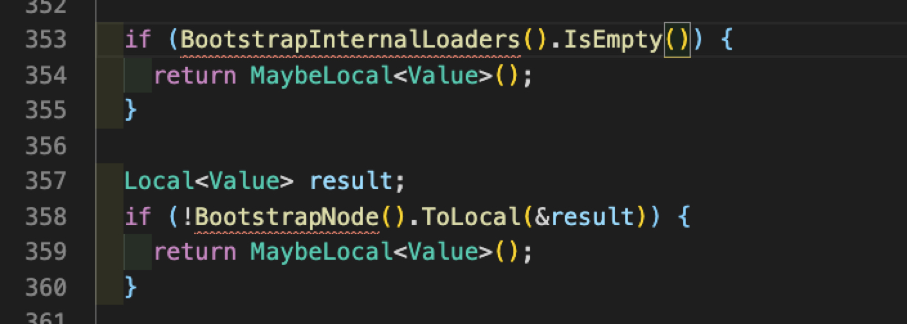

运行 **JS** 代码，**lib/internal** 中的 **loaders** 和 **node**

**FIXED_ONE_BYTE_STRING** 作用是将 **string** 转换为 **Local**

运行 **internal/bootstrap/loaders** 文件的逻辑，同时注入 **process** ，**getLinkedBinding**，**getInternalBinding**，**primordials**，这样在 **Js** 文件内部就可以访问到

**loader_exports** 返回的是 **JS** 文件中 **return** 的 **loader_exports** 对象，包括 **require** 方法， **internalBinding** 方法

**EscapableHandleScope** 的作用是用来要把内部的 **Local** 类型往外返回的时候，避免被 **v8** 回收

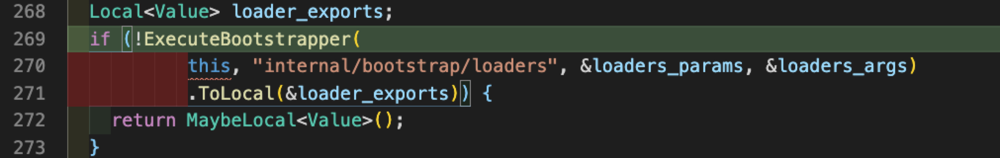

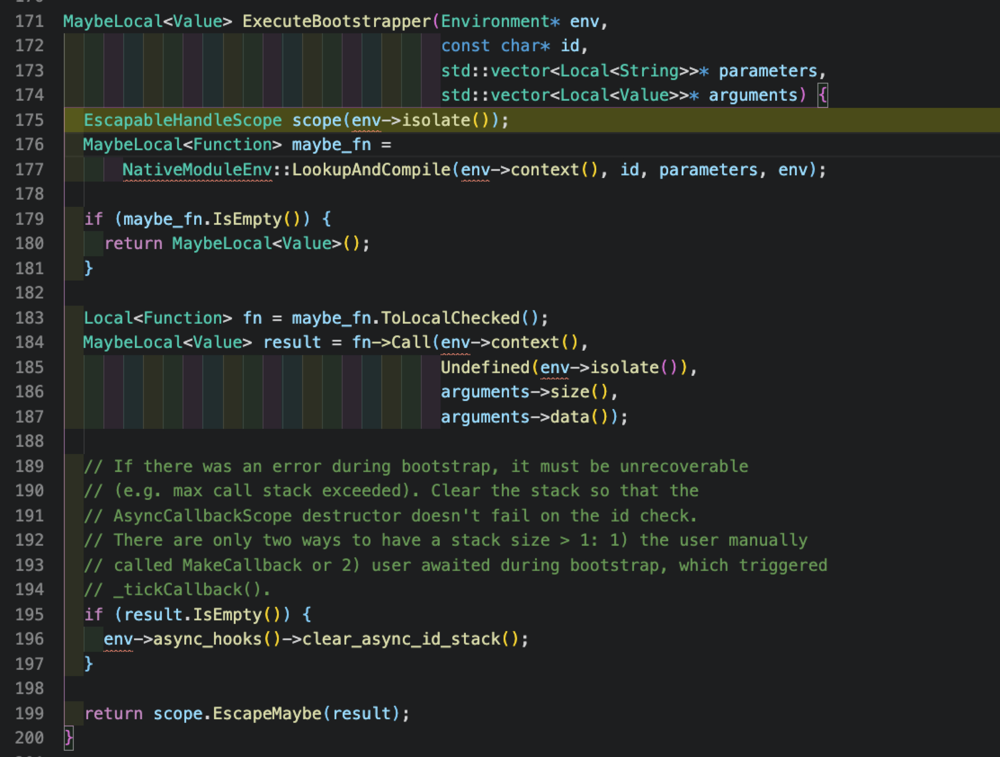

执行 **ExecuteBootstrapper** 中的 **NativeModuleEnv::LookupAndCompile** 拿到 **JS** 的内容后，调用 **->Call** 进行调用

**LoadBuiltinModuleSource** 中根据 **Id** ，即路径名查询， **source\_** 中是提前嵌入的 **lib** 下的 **Js** 文件，如果命中则直接将对应的字符串赋值给 **source**，然后将文件的基本信息保存在 **origin** 中

利用 **ScriptCompiler::CompileFunctionInContext** 注入 **Context**，**然后缓存到 code*cache***

注入 **process.env**

至此 **env->RunBootstrapping()** 完成，**CreateMainEnvironment** 结束

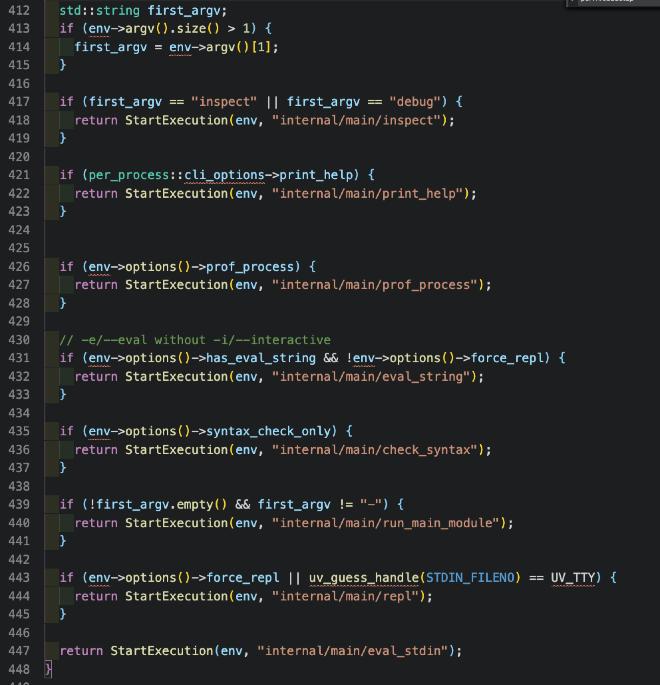

调用 **LoadEnvironment** 装载环境，根据不同的命令行参数运行不同的 **JS**文件，一般情况下，**internal/main/run_main_module**

最后运行 **uv_run** ，启动 **event loop**，如果没有 **active handle** ，那么就准备释放资源和退出程序
